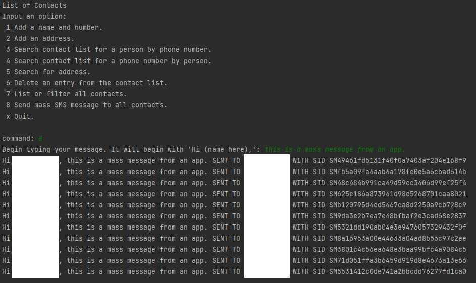

# SMS-Mass-Message-Contact-List
Reads and writes .json file name, number, and address objects for contact information.
Create, replace, update, delete, and search contacts list by name, number, address, or keyword.
Alphabetically lists all contacts.
Sends mass SMS messages to all contacts in the contact list.

#### Author
Danny Chung

## Technologies Used
- Java JDK 11
- Twilio

## SMS Confirmation Screenshot

